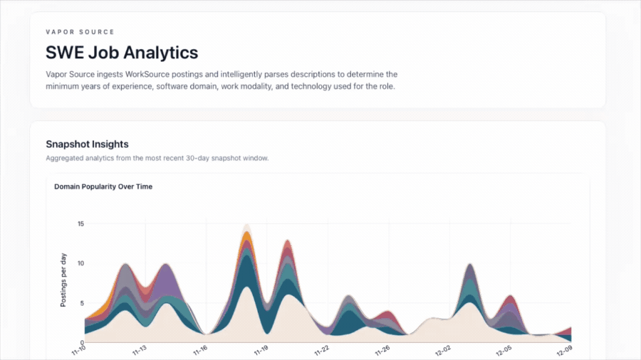

# Vapor Source

<div align="center">
      
</div>

Vapor Source is a full-stack system for scraping, enriching, and exploring software job postings. The current implementation is a cost-minimized Go serverless pipeline; the original Swift + Vapor stack remains in `backend/swift/` as legacy. The pipeline now feeds a React insights frontend in `frontend/vapor-source/`, which renders charts and tables directly against the published snapshots. My main motivation for this project is job boards rarely expose reliable filters for years of experience or true remote eligibility.

## Core Functionality

* **Web scraping:** Go Lambda crawls `worksourcewa.com`.
* **AI-powered enrichment:** OpenAI structured outputs normalize modality, domain, degree, skills, and years of experience.
* **Canonical storage:** Jobs are deduped and stored in DynamoDB (`JobId` PK, `PostedDate` sort key, `PostedDate-Index` GSI).
* **Job ID cache:** In-memory dedupe set is seeded from the S3 `job-ids.txt` and persisted back, so runs remain idempotent across invocations.
* **Snapshot export:** Snapshot Lambda writes per-day JSONL files to S3 and refreshes `snapshot-manifest.json` for consumers (fronted by CloudFront).
* **Legacy (Swift/Vapor):** Kept for reference; no longer the canonical path.

## Architecture Overview

```
EventBridge (cron)
      ↓
Scraper Lambda (Go)
      ↕
In-memory dedupe set ⇄ S3 job ID cache (`job-ids.txt`)
      ↓
DynamoDB (JobId PK, PostedDate SK; GSI PostedDate-Index)
      ↓
Snapshot Lambda (Go)
      ↓
S3 (per-day JSONL + snapshot-manifest.json) → CloudFront (proxy)
      ↓
React Insights UI (fetches /snapshots/*)
```

* Scraper Lambda handles crawling, OpenAI enrichment, S3-synced job ID cache seeding/persisting, dedupe, and writes to DynamoDB.
* When new rows land, the scraper invokes the snapshot Lambda to emit per-day JSONL files.
* CloudFront serves snapshot artifacts without exposing the S3 bucket, and the React UI reads those artifacts for dashboards.

## Technology Stack

* **Languages:** Go (current serverless), Swift (legacy)
* **AI & parsing:** OpenAI structured outputs
* **Data plane:** DynamoDB, S3, CloudFront
* **Compute:** AWS Lambda (+ EventBridge triggers)
* **IaC:** Terraform (`infra/terraform/go-serverless`)
* **Frontend:** React 19 + TypeScript + Vite, Tailwind, TanStack Table, Plotly.js (`frontend/vapor-source/`)
* **Hosting:** Cloudflare Pages
* **Legacy:** Swift Vapor API + PostgreSQL (retained in `backend/swift/`)

## Project Structure

* `backend/go/`: Go Lambdas (`cmd/scraper`, `cmd/snapshot`, `cmd/local`) and shared libs.
* `backend/swift/`: Legacy Swift Lambda + Vapor server.
* `frontend/vapor-source/`: React UI that reads the published snapshots and renders charts/tables.
* `infra/terraform/go-serverless/`: Terraform for the Go stack (Lambdas, DynamoDB, S3, CloudFront, EventBridge).

## Frontend: React Insights UI

The `frontend/vapor-source/` app is a static React + TypeScript SPA. It fetches `snapshot-manifest.json` plus per-day JSONL exports from `/snapshots/`, filters to software-engineering rows, and renders:

* Plotly visualizations (YOE box plots, modality/domain/degree frequency, skills beeswarm, etc.) that aggregate across the fetched days.
* Latest jobs table powered by TanStack Table with client-side sorting/filters.

### Local Workflow (Frontend)

1. `cd frontend/vapor-source && npm ci`.
2. Point the dev server at real snapshot data either by copying assets into `public/snapshots/` (e.g., `aws s3 sync s3://<bucket>/<prefix> public/snapshots`) or by setting `VITE_SNAPSHOT_PROXY_TARGET=https://<cloudfront-domain>/snapshots` so Vite proxies `/snapshots/*` to CloudFront.
3. `npm run dev` to launch the UI at <http://localhost:5173>; it will fetch `/snapshots/snapshot-manifest.json` via the option you chose above.
4. `npm run build && npm run preview` to validate the production bundle locally.

> [!IMPORTANT]
> Deployment details:
> * `functions/snapshots/[[path]].ts` is the Cloudflare Pages Function that proxies `/snapshots/*` to the CloudFront distribution; bind `CLOUDFRONT_BASE_URL` to that origin.
> * Because the UI is static, no backend is required beyond serving the snapshot artifacts. Updating the S3 bucket automatically gives the UI new data.

## Getting Started (Go)

1. **Local run:** `cd backend/go && go run ./cmd/local` (requires `.env` with OpenAI key, AWS creds, query, etc.).
2. **Tests:** `cd backend/go && go test ./...`.
3. **Package Lambdas:** `cd backend/go && make zip-scraper && make zip-snapshot` → `bin/scraper/lambda.zip`, `bin/snapshot/lambda.zip`.
4. **Deploy (Terraform):** `cd infra/terraform/go-serverless && terraform init && terraform apply -var-file=terraform.tfvars`.

### Key configuration (Go)

* `OPENAI_API_KEY` (or `API_DRY_RUN=true`), `QUERY`, `MAX_PAGES`, `MAX_CONCURRENCY`.
* Cache flags: `USE_JOB_ID_FILE`, `USE_S3_JOB_ID_FILE`, `JOB_IDS_BUCKET`, `JOB_IDS_S3_KEY`.
* Data plane: `DYNAMODB_TABLE_NAME`, `SNAPSHOT_BUCKET`, `SNAPSHOT_S3_KEY`.
* Snapshot range overrides: `SNAPSHOT_START_DATE`, `SNAPSHOT_END_DATE`.
* `SNAPSHOT_LAMBDA_FUNCTION_NAME` so the scraper can trigger exports after new writes.

### Snapshot output

Per-day JSONL under `s3://<bucket>/<prefix>/<YYYY-MM-DD>.jsonl` plus `snapshot-manifest.json`. Example record:

```json
{
  "jobId": "abc123",
  "title": "Senior Backend Engineer",
  "company": "Example Tech",
  "location": "Seattle, WA",
  "modality": "Remote",
  "postedDate": "2025-12-03",
  "postedTime": "2025-12-03T14:35:00Z",
  "salary": "$150k - $180k",
  "url": "https://worksourcewa.com/...",
  "minYearsExperience": 5,
  "minDegree": "Bachelor's",
  "domain": "Backend",
  "languages": ["Go", "Python", "Java"],
  "technologies": ["S3", "DynamoDB", "K8s", "..."],
}
```

### Limitations / TODO

* No authentication or personalization; the UI is a public read-only view of whatever the latest snapshots contain.
